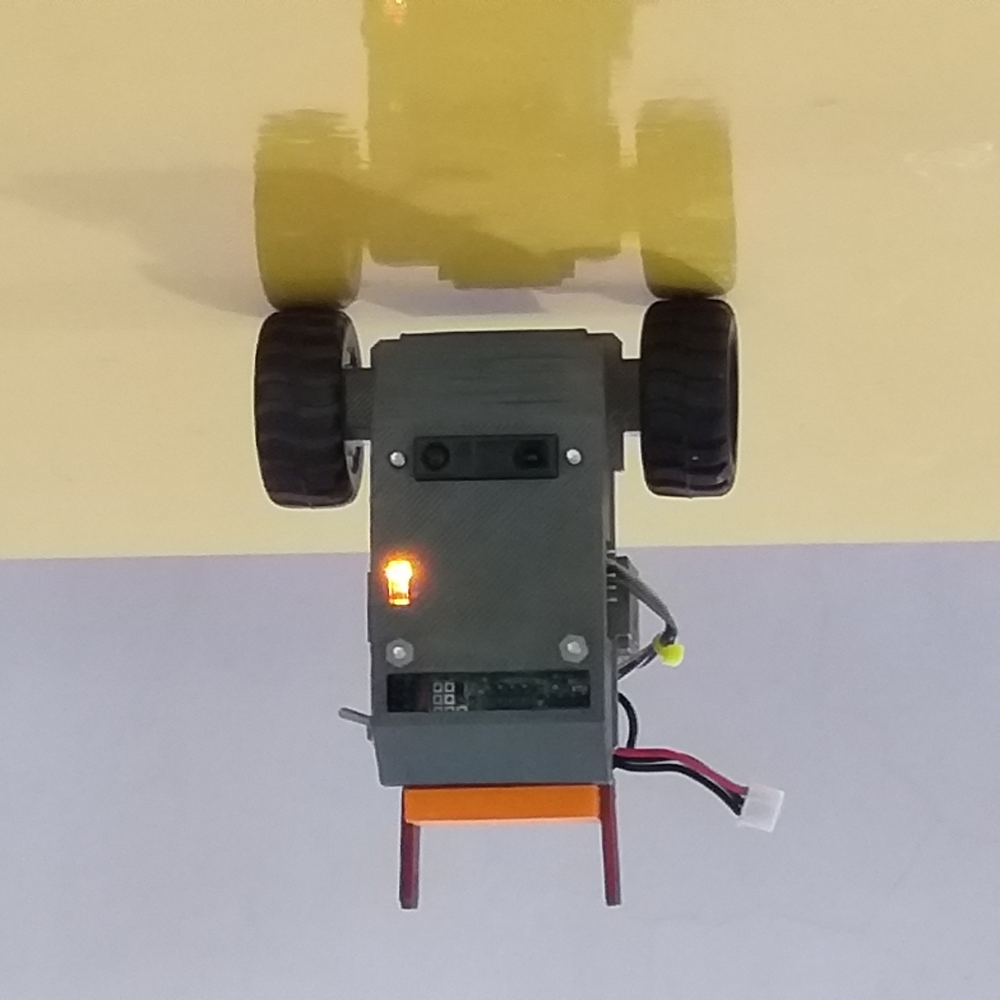

# Two-Wheels_Robot_V2P2 [Updated 8th Aug 2022]

V2P2 is a small two-wheels self-balancing mobile robot platform. It contains a single-core on-board computer as the robot controller. The robot controller handles low-level process such as sampling and processing of sensors output, implementing discrete state feedback control to balance the robot body upright and perform secondary tasks such as moving forward, turning etc. User can communicate with the robot controller through a UART port, at 3.3V CMOS logic, baud rate at 57600 bps. A simple two-way protocols allow the user controller to send instructions to the robot controller to perform simple tasks, for instance asking the robot to move at constant linear speed, turn, drive RC servo motors (the system can support up to 4 RC servos), beep a sound and many more. Thus using this robot platform, in combination with an external controller of the user, an intelligent robot system can be constructed. The external controller can be any micro-controller board capable of working with 5V supply and consuming not more than 100 mA current. Examples are Arduino Nano, Micro, Mini-Pro and Arduino Pro-micro.

In this repository, the following files are provided:
1. Getting started guide.
2. Serial communication protocol between the Robot Controller and User Controller.
3. Using Arduino Nano or Micro as the user controller, examples to communicate with the Robot Controller.
4. Andriod APK file for apps to control the V2P2 robot platform directly via Bluetooth.
5. 3D STL files of the mechanical design.
6. The schematic and PCB layout of the main circuit board. The PCB is a 4-layers board.
7. The firmware for the micro-controller.

